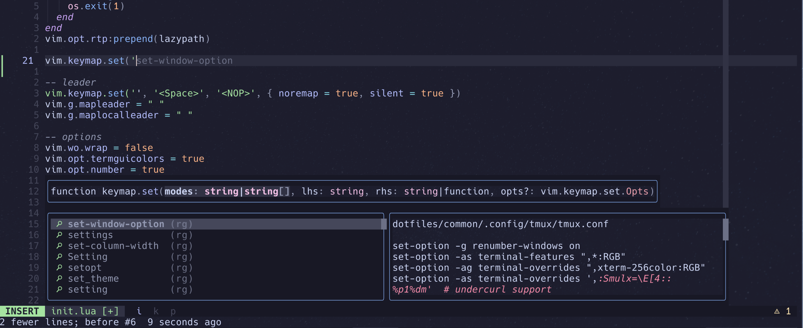
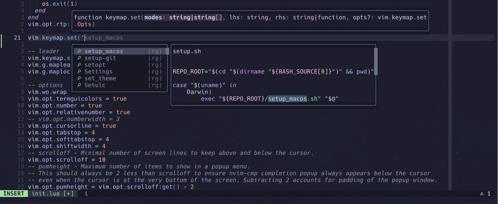

# blink-cmp-layout.nvim

Lays out [blink.cmp](https://github.com/saghen/blink.cmp)'s completion, documentation and
signature windows so they stay clear of the line you are editing, instead of following the
cursor and covering it.

### After


### Stock


- The **signature help window** is held a configurable gap -- 8 rows by default --
  away from the cursor line, on whichever side of the cursor has more room -- below when the
  cursor is in the top half of the window, above when it is in the bottom half -- so it lands on
  the roomier side without needing to move once it is up. It never moves to make room for the
  menu. With `gap = -1` it is held against that side's edge of the window instead -- the bottom
  while the cursor is in the top half, the top while it is in the bottom half -- so the pair
  sits at the edge of the screen rather than following the line being edited.
- The **completion menu** stacks directly onto the far edge of the signature help window
  whenever that window is open, so the two are always on the same side of the cursor line,
  right next to each other, rather than the menu landing on the opposite side by taking its own
  independent guess at which side fits.
- The **documentation window** sits directly beside the menu, sharing its row and height, with
  the two together capped at a configurable width -- 120 columns by default -- so the pair
  never grows wider than the code it covers.
- All three start at the left edge of the *text*, past the number column and the rest of the
  gutter, rather than at the window edge.
- Optionally, signature help is re-requested on every insert-mode cursor move, so it stays up
  for as long as the cursor is inside a call rather than only from the moment you type `(`.

Every window is placed against the window being edited, so nothing moves as results come in,
and nothing is anchored to the cursor.

## Requirements

- Neovim 0.10+
- blink.cmp 1.x

This plugin replaces blink's internal `update_position` functions, which are not part of its
public API. Pin blink to a version range (`version = '1.*'`) so that an upstream refactor
cannot break the layout without warning.

## Installation

The plugin must be set up **after** `require('blink.cmp').setup()`. blink builds its windows
from the merged config the first time they are required, and this plugin requires them as soon
as it is set up -- so setting it up first would leave the windows built from blink's defaults.

With [lazy.nvim](https://github.com/folke/lazy.nvim), that means calling it from blink's own
`config` function rather than passing `opts`:

```lua
{
  'saghen/blink.cmp',
  version = '1.*',
  dependencies = { 'ryanburda/blink-cmp-layout.nvim' },
  opts = {
    -- your usual blink.cmp options
  },
  config = function(_, opts)
    require('blink.cmp').setup(opts)
    require('blink-cmp-layout').setup()
  end,
}
```

Without a plugin manager:

```lua
require('blink.cmp').setup({ --[[ ... ]] })
require('blink-cmp-layout').setup()
```

`setup()` may be called again at any time to change the layout; the new options take effect the
next time a window is placed.

## Configuration

The defaults reproduce everything described above:

```lua
require('blink-cmp-layout').setup({
  -- Checked every time a window is placed, so it may vary by buffer:
  --   enabled = function() return vim.bo.filetype ~= 'markdown' end
  enabled = true,

  -- Widest the menu and documentation window may be *together*, borders
  -- included. The pane is always a limit as well, so a narrow window gives a
  -- narrower pair. Zero or less for no cap of its own.
  max_width = 120,

  -- Rows held clear between the cursor line and the windows; zero puts them
  -- right up against it. Negative (-1) instead locks them to the edge of the
  -- window the side they landed on runs into: the bottom while the cursor is
  -- in the top half, the top while it is in the bottom half.
  gap = 8,

  -- Rows the menu and documentation window are held at, whatever they hold, so
  -- they never resize under you. Defaults to blink's own `completion.menu.max_height`.
  height = function() return require('blink.cmp.config').completion.menu.max_height end,

  -- 'text'   -- left edge past the gutter, leaving line numbers visible
  -- 'window' -- left edge at the window's own edge, over the gutter
  align = 'text',

  -- Which side of the cursor the menu prefers when the signature help window
  -- is closed; it falls through to the next entry when its full height does
  -- not fit, and takes the roomier side when neither does. While the
  -- signature help window is open, the menu instead stacks onto its far
  -- edge, wherever that landed -- see `signature` below -- regardless of
  -- this setting.
  direction = { 'below', 'above' },

  menu = {
    -- Placing the menu is what drives the rest: with this off, the
    -- documentation and signature windows are left to blink as well.
    enabled = true,

    -- Share of the width the menu takes, the documentation window taking the
    -- rest: a fraction of it when <= 1, else a column count. Set to 1 to give
    -- the menu the whole width.
    width = 0.5,
  },

  documentation = {
    -- When off, blink places the documentation window itself -- which it does
    -- relative to the menu window, so it still follows the menu.
    enabled = true,
  },

  signature = {
    -- Leave this on unless `menu.enabled` is off, or blink's own
    -- `signature.enabled` is: blink places the signature window against the
    -- menu and asserts the menu is window-relative, which a managed menu is
    -- not.
    enabled = true,

    -- Re-ask the server for signature help on every insert-mode cursor move,
    -- so the window stays up for as long as the cursor is inside a call.
    -- Costs one (cancellable) request per cursor move.
    follow_cursor = true,
  },
})
```

### Measurements

`max_width` and `gap` are plain numbers, read as they are set. To follow a vim option instead,
read it in your own config -- it is evaluated once, when `setup()` is called:

```lua
require('blink-cmp-layout').setup({
  max_width = tonumber(vim.opt.cc:get()[1]) or 120,
  gap = vim.opt.scrolloff:get(),
})
```

A negative `gap` -- `-1` -- is a mode of its own rather than a smaller number: instead of
holding the windows a fixed number of rows from the cursor line, it holds them against the top
or bottom edge of the window, whichever edge the side they landed on runs into. The signature
help window takes that edge and the menu stacks onto it, growing back towards the cursor line,
so the pair stays put as the cursor moves around the half of the screen it is not in. `gap = 0`
keeps its plain meaning: no gap at all, the windows right up against the cursor line.

`height` accepts a number, or a function returning one, called with the pane being placed
against every time a window is placed -- so it can follow something that changes as you work:

```lua
height = function(pane) return math.floor(pane.height / 3) end
```

Returning nothing falls back to blink's own `completion.menu.max_height`.

The pane passed to a function is the text area of the window being edited, in editor-relative
(0-indexed) coordinates:

```lua
--- @class blink-cmp-layout.Pane
--- @field row number    Topmost editor row of the text area
--- @field col number    Leftmost editor column of the text area
--- @field height number
--- @field width number
```

## Recommended blink.cmp settings

These are blink's own options, not this plugin's, but they are what the layout was built
around:

```lua
opts = {
  completion = {
    menu = { border = 'rounded', max_height = 8 },
    documentation = {
      auto_show = true,
      auto_show_delay_ms = 0,
      window = { border = 'rounded', max_height = 8 },
    },
  },
  signature = {
    enabled = true,
    -- blink's defaults only ask the server on '(' and ',', so the window never
    -- appears when the cursor moves into a call that is already written. With
    -- `signature.follow_cursor` on, this is all that is left to cover:
    -- entering insert mode inside one.
    trigger = { show_on_insert = true },
    window = { border = 'rounded' },
  },
}
```

`completion.documentation.auto_show` is worth turning on: the documentation window is where the
signature of the item you are highlighting comes from, and with the layout it no longer covers
anything.

## How it works

blink exposes no options for window placement, so the plugin replaces the `update_position`
function on each of `blink.cmp.completion.windows.menu`,
`blink.cmp.completion.windows.documentation` and `blink.cmp.signature.window`. Every caller
looks those up on the module table at call time, so replacing them covers all of them, and the
originals are kept for the cases the plugin does not handle.

The cmdline completion menu is always left to blink: it is anchored to the command line rather
than to a window, and has no pane to be laid out against.

Windows are anchored with `relative = 'editor'`. A float's `row` / `col` address its outer
corner, with the border drawn inside them, which is why every measurement here counts the
border.
